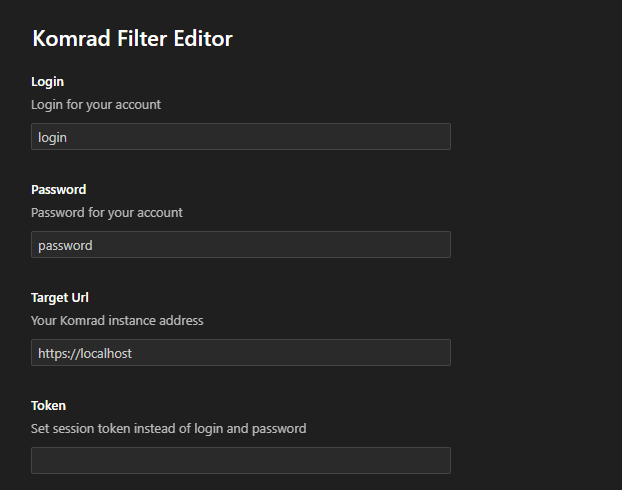
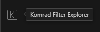
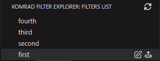

# Komrad Filter Editor

Это расширение предназначено для редактирования фильтров в SIEM Komrad. Пока функционал весьма ограничен и довольно примитивен.

This extension is designed for editing filters in SIEM Komrad. While the functionality is very limited and rather primitive.

## Возможности (Features)

- Получение списка фильтров (Getting a list of filters)
- Открытие фильтра в открытом текстовом окне (Opening the filter in an open text window)
- Загрузка фильтра обратно в SIEM (Uploading the filter back into SIEM)

Кратко опишу работу с расширением. 

Сначала необходимо в настройках указать адрес SIEM и учетные данные. Если используете логин и пароль, оставляйте поле токена пустым. Если используете токен, учетные данные могут быть любыми. 

First, you need to specify the SIEM address and credentials in the settings. If you use a username and password, leave the token field empty. If you use a token, the credentials can be anything.

После найдите панели слева иконку расширения. 

After that, find the extension icon on the left panel.

Если все данные указаные верно, фильтры будут загружены и видны на панели. Если навести курсор на фильтр, будут достумпны две опции: редактирование и загрузка. Первая - вставляет код фильтра в открытое текстовое окно. В случае если оно не открыто, можно использовать сочетания *Ctrl+N*. Вторая -- загружет все содержимое текстового окна как код фильтра.

If all the data is specified correctly, the filters will be loaded and visible on the panel. If you hover the cursor over the filter, two options will be available: edit and upload. The first one inserts the filter code into an open text window. If it is not open, you can use the combinations *Ctrl+N*. The second one loads the entire contents of the text window as a filter code.

## Зависимости (Requirements)

Не знаю что тут писать, ввиду отсутствия опыта. Помимо необходимых вещей, которые загрузил VS Code Extension Generator, используется `node-fetch`. 

I don't know what to write here, due to lack of experience. In addition to the necessary things that VS Code Extension Generator loaded, `node-fetch` is used.

## Настройки расширения (Extension Settings)

Это расширение предоставляет следующие настройки:

- `komrad-filter-editor.targetUrl`: адрес вашего Комрада;
- `komrad-filter-editor.login`: Логин учетной записи;
- `komrad-filter-editor.password`: Пароль учетной записи;
- `komrad-filter-editor.token`: Вместо учетных данных можно указать сессионный токен.

This extension contributes the following settings:

- `komrad-filter-editor.targetUrl`: Your Komrad instance address;
- `komrad-filter-editor.login`: Login for your account;
- `komrad-filter-editor.password`: Password for your account;
- `komrad-filter-editor.token`: Set session token instead of login and password.

## Известные проблемы (Known Issues)

Эта ранняя версия, поэтому возможны различные непредсказуемые проблемы.

This is an early version, so various unpredictable problems are possible.

- На данный момент игнорируется проверка сертификата. Планируется добавить функцию позже. (Certificate verification is ignored at the moment. It is planned to add this feature later.)

## Примечания к выпуску (Release Notes)

### 0.0.1

Это начальный выпуск. Представлены некоторые основные функции.

This is the initial release. Some basic functions are presented.
